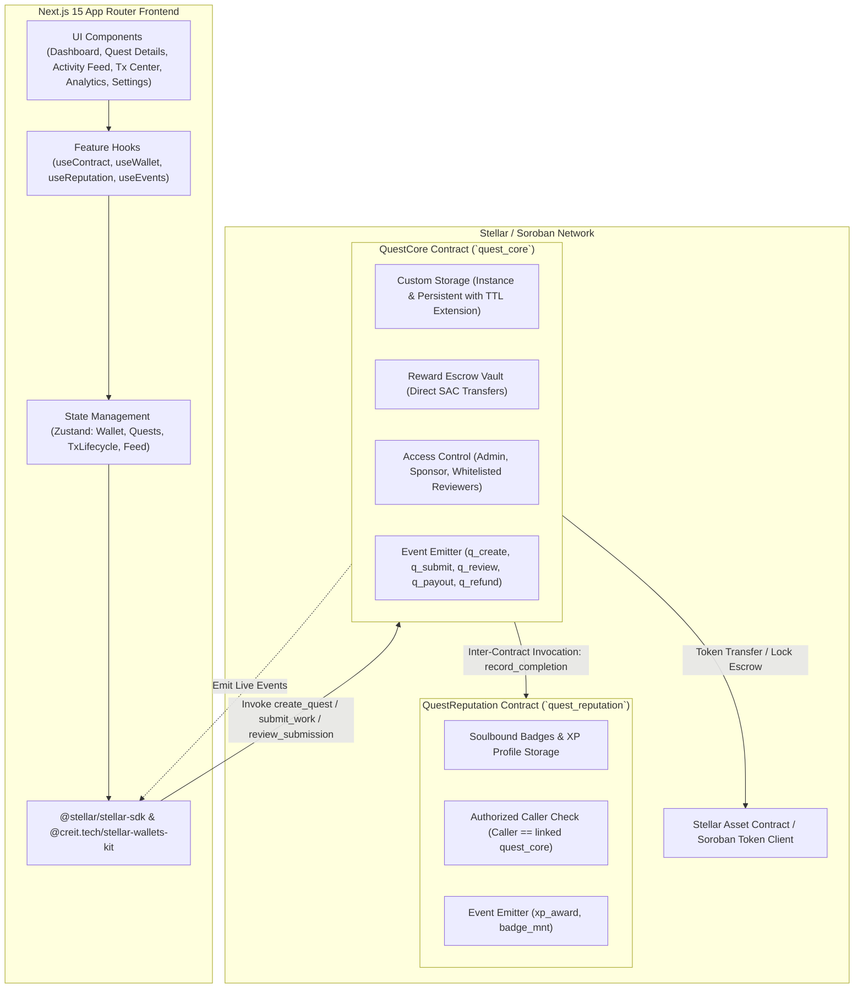
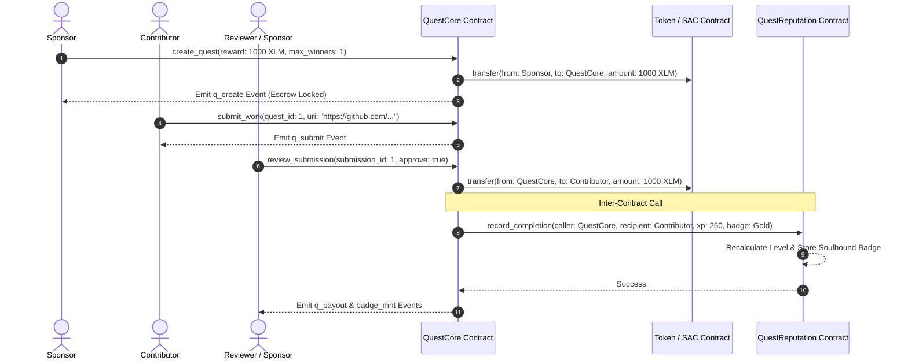

# Quest & Rewards Platform (Orange Belt Level 3)

[](https://github.com/prerana-techi/Quest-Rewards-Platform/actions/workflows/contract_tests.yml)
[](https://github.com/prerana-techi/Quest-Rewards-Platform/actions/workflows/frontend_ci.yml)
[](https://questrewardplatform.netlify.app)
[](https://opensource.org/licenses/Apache-2.0)
[](https://stellar.org)

> **Decentralized, on-chain bounty & quest platform on Stellar / Soroban** — post developer quests, lock reward tokens into non-custodial escrow, verify submissions trustlessly with role-based access control (RBAC), and auto-release payouts with cross-contract soulbound reputation badge minting. Built for hackathons, DAOs, and developer communities.

### 🌐 Live Deployment

🔗 **Live App**: [https://questrewardplatform.netlify.app](https://questrewardplatform.netlify.app)

### 🎬 Demo Video

[](YOUR_YOUTUBE_VIDEO_LINK_HERE)

> 📹 **Full Walkthrough**: [YOUR_YOUTUBE_VIDEO_LINK_HERE](YOUR_YOUTUBE_VIDEO_LINK_HERE)
>
> *Replace the link above with your YouTube video URL once uploaded.*

---

## 🌟 Table of Contents
1. [Product Overview & Problem Statement](#-product-overview--problem-statement)
2. [Architecture & System Design](#-architecture--system-design)
3. [Smart Contract Architecture](#-smart-contract-architecture)
4. [Inter-Contract Communication Flow](#-inter-contract-communication-flow)
5. [Frontend & Multi-Wallet Integration](#-frontend--multi-wallet-integration)
6. [Contract Addresses & Explorer Links](#-contract-addresses--explorer-links)
7. [Getting Started (Local Development)](#-getting-started-local-development)
8. [Deployment Strategy (Testnet & Standalone)](#-deployment-strategy-testnet--standalone)
9. [Automated Testing Suite](#-automated-testing-suite)
10. [Security Model & Audit Checklist](#-security-model--audit-checklist)

---

## 💡 Product Overview & Problem Statement

### The Problem
Traditional bounty platforms and hackathons suffer from:
- **Centralized Custody & Payment Disputes**: Sponsors may fail or delay releasing funds after contributors submit code.
- **Manual Approvals & Middlemen**: High administrative friction and opaque judging processes.
- **Fragmented Developer Portfolios**: Work completed across web2 platforms cannot be verified on-chain or composed into Web3 identity.

### The Solution
The **Quest & Rewards Platform** eliminates intermediaries through atomic Soroban smart contracts:
1. **Trustless Escrow**: Sponsors deposit reward tokens (XLM or Stellar Asset Contracts) directly into the `quest_core` contract upon bounty creation.
2. **Deterministic Auto-Payout**: Approved submissions trigger direct contract token transfers to the contributor's wallet in the same transaction.
3. **Cross-Contract Soulbound Badges**: Completion invokes the linked `quest_reputation` contract to mint non-transferable achievement badges and increment on-chain XP/levels.
4. **Deadline Guarantees**: Expired bounties with unfilled winner slots allow sponsors to reclaim remaining escrow via verifiable timelock checks.

---

## 🏗️ Architecture & System Design



---

## 📜 Smart Contract Architecture

The protocol is composed of two interacting Soroban smart contracts written in Rust:

### 1. `quest_core`
- **Role**: Manages quest lifecycle, token escrow, submission recording, reviewer permissions, and expiration refunds.
- **State Machine**:
  $$\text{Draft} \longrightarrow \text{Open} \longrightarrow \text{InReview} \longrightarrow \text{Completed} \ / \ \text{Expired} \ / \ \text{Cancelled}$$
- **Key Functions**:
  - `initialize(admin, reputation_contract)`
  - `create_quest(sponsor, token, amount, xp, badge_tier, title, uri, deadline, max_winners, reviewer)`
  - `submit_work(contributor, quest_id, submission_uri)`
  - `review_submission(reviewer, submission_id, approve, feedback)`
  - `refund_expired_quest(sponsor, quest_id)`
  - `set_reviewer(admin, reviewer, is_active)`
  - `set_paused(admin, paused)`
  - `upgrade(admin, new_wasm_hash)`

### 2. `quest_reputation`
- **Role**: Maintains non-transferable developer credentials, XP progression, and soulbound badge records.
- **Inter-Contract Target**: Only callable by the whitelisted `quest_core` contract address.
- **Key Functions**:
  - `initialize(admin, quest_core)`
  - `record_completion(caller, recipient, quest_id, reward_amount, xp_amount, badge_tier, badge_uri)`
  - `get_profile(account) -> ReputationProfile`
  - `get_badge(account, index) -> BadgeRecord`
  - `get_all_badges(account) -> Vec<BadgeRecord>`
  - `upgrade(admin, new_wasm_hash)`

---

## 🔄 Inter-Contract Communication Flow



---

## ⚡ Frontend & Multi-Wallet Integration

- **Framework**: Next.js 15 App Router + TypeScript + Tailwind CSS
- **Wallet Signer**: Integrated with **`StellarWalletsKit`**, providing out-of-the-box support for:
  - 🚀 **Freighter Wallet**
  - 🐂 **xBull Wallet**
  - 🌐 **Albedo**
  - 🌸 **Hana Wallet**
  - 🦞 **Lobstr Wallet**
- **State Layer**: Modular **Zustand** stores separating wallet authentication, transaction lifecycles, and real-time feeds.
- **Core Pages**:
  1. **Landing (`/`)**: Hero, live protocol statistics, architecture overview, and badge preview.
  2. **Dashboard (`/dashboard`)**: Filterable quest discovery, search, tags, and reviewer judging queue.
  3. **Quest Details (`/quest/[id]`)**: Full specifications, escrow security inspector, and submission stream.
  4. **Activity Feed (`/activity`)**: Real-time Soroban event stream with filterable timeline.
  5. **Transaction Center (`/transactions`)**: Live lifecycle tracker (`signing` $\to$ `submitting` $\to$ `confirmed` / `failed`) with hash exploration.
  6. **Analytics (`/analytics`)**: Escrow volume charts, completion velocity, and top contributor leaderboard.
  7. **Settings (`/settings`)**: Network selection (Testnet, Local, Mainnet), RPC endpoint config, and session management.

---

## 📋 Contract Addresses & Explorer Links

| Contract | Network | Contract ID | Stellar Expert Link |
| :--- | :--- | :--- | :--- |
| **`quest_core`** | Stellar Testnet | `CAAAAAAAAAAAAAAAAAAAAAAAAAAAAAAAAAAAAAAAAAAAAAAAAAAAMDR4` | [View Core Contract](https://stellar.expert/explorer/testnet/contract/CAAAAAAAAAAAAAAAAAAAAAAAAAAAAAAAAAAAAAAAAAAAAAAAAAAAMDR4) |
| **`quest_reputation`** | Stellar Testnet | `CAAAAAAAAAAAAAAAAAAAAAAAAAAAAAAAAAAAAAAAAAAAAAAAAAAAK3IM` | [View Reputation Contract](https://stellar.expert/explorer/testnet/contract/CAAAAAAAAAAAAAAAAAAAAAAAAAAAAAAAAAAAAAAAAAAAAAAAAAAAK3IM) |
| **Native XLM SAC** | Stellar Testnet | `CDLZFC3SYJYDZT7K67VZ75HPJVIEUVNIXF47ZG2FB2RMQQVU2HHGCYSC` | [View SAC Token](https://stellar.expert/explorer/testnet/contract/CDLZFC3SYJYDZT7K67VZ75HPJVIEUVNIXF47ZG2FB2RMQQVU2HHGCYSC) |

*(Note: Run `./scripts/deploy_testnet.sh` to deploy your fresh instance and update the IDs in `.env.local`).*

---

## 🚀 Getting Started (Local Development)

### Prerequisites
- Node.js `v20+` & `npm`
- Rust `1.80+` with `wasm32-unknown-unknown` target
- Stellar CLI (`stellar --version`)

```bash
# 1. Clone repository
git clone https://github.com/prerana-techi/Quest-Rewards-Platform.git
cd Quest-Rewards-Platform

# 2. Install frontend dependencies
npm install

# 3. Setup environment variables
cp .env.example .env.local

# 4. Run test suites
cargo test --manifest-path contracts/Cargo.toml
npm run test

# 5. Launch local Next.js dev server
npm run dev
```
Open [http://localhost:3000](http://localhost:3000) in your browser.

---

## 🛠️ Deployment Strategy (Testnet & Standalone)

### Deploy to Stellar Testnet
The automated deployment script builds WASM binaries, funds a deployer identity via Friendbot, deploys both contracts, initializes inter-contract links, and outputs metadata:

```bash
# Deploy to testnet
./scripts/deploy_testnet.sh

# Or run dry-run verification
./scripts/deploy_testnet.sh --dry-run
```

### Upgrade Contracts In-Place
Soroban contracts support seamless WASM bytecode updates without losing persistent state:

```bash
./scripts/upgrade_contract.sh core <CONTRACT_ID> contracts/target/wasm32-unknown-unknown/release/quest_core.wasm testnet quest-deployer
```

---

## 🧪 Automated Testing Suite

### Smart Contract Tests (Rust / Soroban SDK Testutils)
```bash
cargo test --manifest-path contracts/Cargo.toml -- --nocapture
```
- ✅ `test_full_quest_lifecycle_with_inter_contract_reputation`: End-to-end token escrow, work submission, reviewer approval, and inter-contract badge/XP minting.
- ✅ `test_quest_expiration_and_refund_flow`: Simulates timelock passage and validates sponsor escrow refund.
- ✅ `test_rejection_and_emergency_pause`: Asserts reviewer rejection and pause safeguards.
- ✅ `test_reputation_initialization_and_access_control`: Asserts unauthorized callers cannot award XP.

### Frontend Unit & Integration Tests (Vitest + RTL)
```bash
npm run test
```
- ✅ `WalletStore.test.ts`: Multi-wallet state, session persistence, and network switching.
- ✅ `QuestStore.test.ts`: Quest filtering, search query matching, and optimistic updates.
- ✅ `TransactionStore.test.ts`: Transaction lifecycle transitions and retry actions.
- ✅ `BadgeDisplay.test.tsx`: Visual badge tier rendering and XP chip formatting.
- ✅ `IntegrationFlow.test.ts`: Full decentralized bounty simulation test.

---

## 🛡️ Security Model & Audit Checklist

- **Strict Access Control**: `record_completion` verifies `caller == storage::get_quest_core()`.
- **Storage TTL Management**: All persistent and instance entries use `extend_ttl` bumps (`518,400` ledgers $\approx 30$ days) to prevent state expiration.
- **Checked Arithmetic**: Financial balances use `checked_mul` and `saturating_add` against overflow exploits.
- **Emergency Circuit Breaker**: Contract administrator can pause invocations via `set_paused` during incidents.
- **Non-Custodial Architecture**: Contract holds assets only while quests are active; refunds are cryptographically guaranteed after deadlines.
