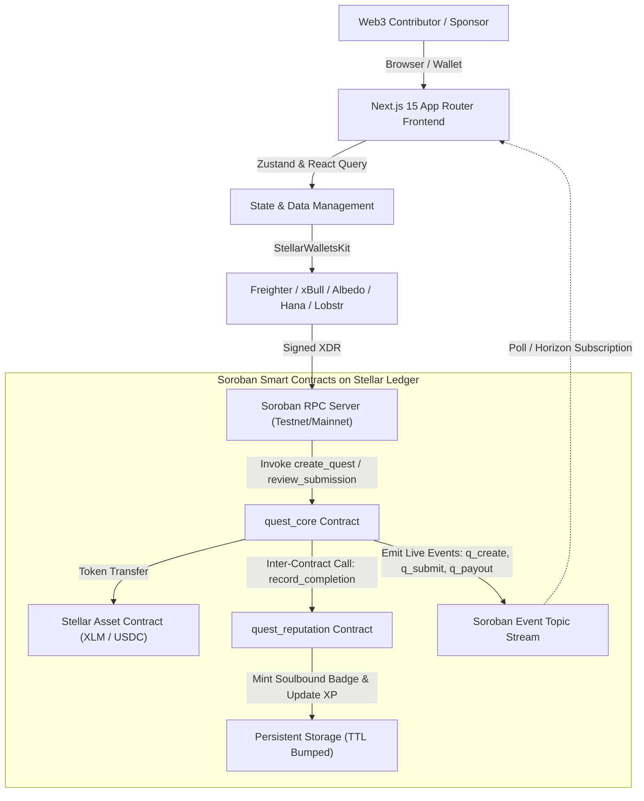

# Stellar Orange Belt Architecture Deep Dive

The **Quest & Rewards Platform** is designed according to the highest standards of Soroban smart contract development, modular frontend architecture, and production-grade state management.

---

## 🏛️ System Overview



---

## 💾 Storage Architecture & TTL Management

Soroban requires contracts to manage the time-to-live (TTL) of storage entries. Without proper extensions, archived entries become inaccessible.

### Storage Tiers Used:
1. **Instance Storage**:
   - Stores global configuration: `Admin`, `Paused` flag, `ReputationContract` address, and incremental counters (`NextQuestId`, `NextSubmissionId`).
   - Extended using `bump_instance` on every invocation with `extend_ttl(100_000, 518_400)` (~30 days).
2. **Persistent Storage**:
   - Stores user-specific and quest-specific data: `Quest(u64)`, `Submission(u64)`, `Profile(Address)`, `Badge(Address, u32)`.
   - Every read and write automatically invokes `env.storage().persistent().extend_ttl(&key, 100_000, 518_400)`.

---

## 🔐 Inter-Contract Client Pattern

When `quest_core` calls `quest_reputation`, it uses the Soroban interface client:

```rust
#[allow(dead_code)]
#[contractclient(name = "QuestReputationClient")]
pub trait QuestReputationInterface {
    fn record_completion(
        env: Env,
        caller: Address,
        recipient: Address,
        quest_id: u64,
        reward_amount: i128,
        xp_amount: u32,
        badge_tier: u32,
        badge_uri: String,
    );
    fn record_quest_created(env: Env, caller: Address, creator: Address);
}
```

In `quest_reputation`, authorization is strictly checked:
```rust
caller.require_auth();
let authorized_core = storage::get_quest_core(&env).expect("Quest core not set");
if caller != authorized_core {
    panic!("Unauthorized caller: only quest_core can record completions");
}
```
This guarantees that XP and soulbound achievement badges cannot be minted or spoofed directly by malicious actors.
